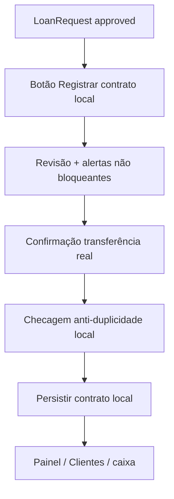

# ADR — Bloco 2: Conversão Governada de LoanRequest aprovado em Contrato Local

**Tipo:** Architectural Decision Record + plano executável futuro  
**Projeto:** AGEmp / Finanças Pro  
**Escopo:** Bloco 2 — pré-financeiro remoto (`loanRequests`) → contrato financeiro **local**, só após confirmação humana explícita

---

## 1. Status

| Dimensão | Valor |
|----------|--------|
| **Estado da decisão** | **Aprovado pela governança** para orientar a implementação do Bloco 2 em subfases — **implementação do MVP + fecho documental concluídos** (ver §8 e histórico). |
| **Natureza deste documento** | ADR **e** plano executável (fonte viva para o Bloco 2; regressões complementares em [`QA_MATRIX_LOANREQUEST_V1_1.md`](./QA_MATRIX_LOANREQUEST_V1_1.md) § Bloco 2). |
| **Implementação do produto** | **Bloco2-0** (ADR/plano + governança) **concluído** (`d6150d2`, `41c637b`). **Bloco2-A–D** (código) **concluídos** — **`624c725`** (entrada + revisão), **`3badcbc`** (persistência + anti-duplicidade), **`5dd4c36`** (UX pós-conversão). **Bloco2-E** (QA smoke manual + atualização destes docs vivos) **concluído** conforme registo em §10 / matriz QA. |
| **Base de elaboração** | Planeamento Cursor `adr-bloco2-conversao-governada_13970c4c.plan.md` + guardrails do projeto + código/documentação existentes |

### Registo de aprovação (governança)

| Decisão | Registo |
|---------|---------|
| ADR Bloco 2 | **Aprovado** — vale como especificação para PRs futuros do Bloco 2, dentro dos guardrails deste documento. |
| Próxima subfase (pós-MVP Bloco 2) | **Não é continuação do mesmo MVP.** Próximo trabalho recomendado pela governança: **mini ADR/plano** *«Identidade pública e snapshots de nomes em vínculos/pedidos»* (§ Limitações); depois, **Visão Fornecedores / UX por papel**. |
| MVP remoto | **Sem marcação remota** de conversão; **A2b/A2c** permanecem **backlog**. |
| **D6** — data do contrato | **Fechada:** ver §9 e §7 — **data da conversão local** (= **data atual** no momento do **registo efectivo** do contrato após fluxo de revisão/confirmação futuro Bloco2-B/C). |

---

## 2. Estado atual confirmado

### 2.1 Fatos já consolidados no repositório e nos docs vivos

- **`loanRequest` v1 e v1.1** estão **fechados** (smoke manual, QA dedicadas; LKG **`lkg-2026-05-03-loanrequest-v1-1`**). Detalhe: [`QA_MATRIX_LOANREQUEST_V1_1.md`](./QA_MATRIX_LOANREQUEST_V1_1.md), [`FIRESTORE_LOANREQUESTS.md`](./FIRESTORE_LOANREQUESTS.md).
- **Bloco 1** (`loanRequests` operacional) está **funcionalmente fechado** (Opção A); plano arquivado: [`plans/completed/PLANEJAMENTO_BLOCO1_LOANREQUEST_OPERACIONAL.md`](./plans/completed/PLANEJAMENTO_BLOCO1_LOANREQUEST_OPERACIONAL.md) — **histórico**, não plano ativo.
- **`loanRequests`** é camada **pré-financeira** somente; **pedido `approved` não cria contrato local nem remoto automaticamente**.
- **Domínio financeiro** continua **local-first** (`localStorage`, escopo `anonymous` / `account:{uid}`).
- **Firebase não é fonte financeira autoritativa**: não há sync financeiro remoto autoritativo de clientes, contratos, pagamentos, caixa ou dashboard.
- **`payment.linkContext`** não é persistido (ADR atual: [`ADR_PAYMENT_LINK_CONTEXT.md`](./ADR_PAYMENT_LINK_CONTEXT.md)).
- **`calculations.js`** é motor único e neste MVP da conversão **não deve ser alterado** pela especificação do Bloco 2.

### 2.2 Lacuna de produto (motivação)

Um **`LoanRequest` `approved`** **corretamente** não aparece no Painel nem nos dados financeiros locais porque só existe como **intenção relacional/remota**. Falta uma **ponte governada**: registar no livro **local** o contrato **depois** de o utilizador confirmar que a **transferência real** já ocorreu no mundo físico/bancário (fora do app).

---

## 3. Decisão arquitetural recomendada

### 3.1 Princípios

1. **Conversão manual**, iniciada pelo **fornecedor** no MVP (quem mantém o cadastro local de empréstimos neste modelo).
2. **Fluxo guiado**: revisão explícita **antes** de qualquer persistência financeira local.
3. **Confirmação humana obrigatória** com formulário inequívoco (checkbox ou equivalente): *«A transferência real já foi feita?»*
4. **Nenhum efeito financeiro** (novo contrato no modelo local → reflexo em caixa/Painel/Total na Rua) **antes** da **confirmação final** neste fluxo.
5. **Sem marcação remota no MVP** — não novo campo Firestore, não mudança a **`firestore.rules`**, não dependência de escrita remota para a conversão.
6. **Anti-duplicidade local mínima** obrigatória: antes de criar contrato, verificar que **`convertedFromLoanRequestId`** (ou nome equivalente acordado) **ainda não** existe em nenhum `loan` no escopo.
7. **Sem alteração a `calculations.js`** e **`firestore.rules`** no MVP do Bloco 2.
8. O contrato criado deve ser **indistinguível** do ponto de vista do motor face a um contrato criado pelo fluxo manual existente (mesmo shape de dados permitido pelo `storage`/normalização).

### 3.2 Resumo da decisão

**Adoptar** conversão governada **100% local** após confirmação humana, com **referência ao id do pedido remoto** só como **metadado local opcional** no contrato (`convertedFromLoanRequestId`), **herança explícita** de **`loan.linkContext` v1** quando o pedido trouxer `linkId`, `supplierId` e `clientId`, e **alerta não bloqueante** quando `availableMoney` local for inferior ao montante — **sem bloquear** a conversão no MVP.

---

## 4. Escopo do MVP

### 4.1 Entra (após aprovação do ADR e execução subfase a subfase)

- Botão futuro **«Registrar contrato local»** (ou equivalente) apenas para **`LoanRequest`** com **`status === 'approved'`** (inclui aprovação directa e aprovação após aceite de contraproposta — ambos terminam em `approved` com `approvedAmount` definido; ver [`FIRESTORE_LOANREQUESTS.md`](./FIRESTORE_LOANREQUESTS.md)).
- **Tela/modal de revisão** com campos essenciais (valor, datas sugeridas, taxa, cliente, notas legíveis do pedido conforme UX).
- **Confirmação humana obrigatória** da transferência real + microcopy de que **o app não transfere dinheiro** e **não valida conta bancária**.
- **Criação de contrato local** apenas após essa confirmação, reutilizando o pipeline de atualização de `clients` já existente (`onUpdateClients` / persistência por escopo).
- **Reuso ou criação** de cliente local; **sem escolha automática** quando houver **múltiplos candidatos** plausíveis (ver §5).
- Campo local **`convertedFromLoanRequestId`** (string = id do documento Firestore do pedido) para **anti-duplicidade** e rastreabilidade operacional local.
- **`loan.linkContext` v1** no contrato criado quando `linkId`, `supplierId` e `clientId` estiverem presentes no pedido — **não** implica `payment.linkContext`.
- Reflexo em **Painel**, **Clientes**, **Total na Rua**, **caixa** e restante ciclo **via fluxo local já existente** (novo `loan` no cliente).

### 4.2 Fica fora do MVP

- Marcação remota (`converted_to_contract` ou campos equivalentes), **qualquer** escrita Firestore motivada pela conversão.
- Conversão iniciada pelo **cliente** ou UI espelhada no cliente para «gerar contrato».
- Conversão **automática** ou **em lote**.
- **Sync financeiro remoto** autoritativo.
- **`payment.linkContext`** persistido.
- Alterações a **`calculations.js`** para «ajustar» valores pelo pedido remoto.
- Alterações a **`firestore.rules`** / schema Firestore.
- Reabertura **A2b/A2c** como dependência do Bloco 2.

---

## 5. Decisões ajustadas (ressalvas obrigatórias)

### 5.1 Taxa de juros

- **Pré-preencher** com `settings.defaultInterestRate` (ou fallback já usado no app para novo contrato).
- **Permitir edição na revisão** **desde que** o comportamento seja **coerente** com o fluxo manual atual de criação de contrato no `ClientView` (campos editáveis de taxa já existem no formulário manual).  
- **Pendência explícita:** antes do primeiro commit de código da **Bloco2-B/C**, confirmar no código o contrato exacto de validação (mínimos, máximos, mensagens) para não divergir do manual.

### 5.2 Cliente local

- Preferir **nome remoto fiável** quando disponível (ex.: `displayName` do utilizador cliente), com **fallback** textual do tipo **«Cliente [prefixo do clientId]»** ou equivalente definido na implementação.
- **Recomendar** campo de **edição do nome na revisão** antes de criar cliente novo (ou antes de confirmar associação).
- Se existirem **vários clientes locais** candidatos (ex.: mesmo `linkId` em `client.linkContext`), **não escolher automaticamente**: obrigar **selecção explícita** pelo fornecedor.

### 5.3 Anti-duplicidade

- A verificação por **`convertedFromLoanRequestId`** é **mínimo obrigatório** e deve executar-se **imediatamente antes** de qualquer mutação que adicione o contrato — **Bloco2-C não pode persistir contrato sem esta checagem**.
- **Bloco2-D** pode reforçar UX (rótulo «Já registado localmente», desactivação de botão, mensagens).

### 5.4 `loan.linkContext`

- Se o pedido contiver **`linkId`**, **`supplierId`** e **`clientId`**, o contrato criado deve receber **`loan.linkContext` v1** como **snapshot local** explícito (formato alinhado a [`HANDOFF_MASTER.md`](./HANDOFF_MASTER.md) / utilitários existentes).  
- **Não** criar nem persistir **`payment.linkContext`**.

### 5.5 `availableMoney`

- **Alerta informativo, não bloqueante**, quando o montante a registar exceder o **`availableMoney`** já calculado pelo app (mesma grandeza que no Painel), espelhando a filosofia do **Bloco 1 / B2**.  
- **Não bloquear** a conversão no MVP por este motivo — decisão consciente de produto; o utilizador confirma após ver o aviso.

### 5.6 Marcação remota

- **Fora do MVP.** Backlog: eventual campo/`status` remoto exigiria **ADR complementar**, **rules**, **`FIRESTORE_LOANREQUESTS.md`**, **`npm run test:rules:loanRequests`** e QA próprios.

---

## 6. Fluxo conceitual

```text
LoanRequest approved (remoto, pré-financeiro)
  → Fornecedor: botão «Registrar contrato local»
  → Revisão (valor, taxa editável, data, cliente, linkContext implícito se dados completos)
  → Alerta opcional se availableMoney < montante (não bloqueante)
  → Confirmação obrigatória: «A transferência real já foi feita?»
  → Anti-duplicidade local (convertedFromLoanRequestId)
  → Criação/atualização cliente local + novo loan local
  → Reflexo: Clientes, Painel, Total na Rua, caixa (motor existente)
```

**Diagrama (referência):**



---

## 7. Modelagem local proposta (alvo de implementação)

| Aspecto | Especificação |
|---------|----------------|
| **Identificação da proveniência** | `convertedFromLoanRequestId`: string (id Firestore do `loanRequests/{id}`) |
| **Valor principal** | `approvedAmount / 100` em **reais** (inteiro Firestore em centavos → modelo local já em reais no fluxo atual de formulários) |
| **Data do contrato** | **Decidido (D6):** usar a **data da conversão local** — equivalente à **data atual** no momento em que o fornecedor **confirma** e o produto **persiste** o contrato (Bloco2-B/C futuro). **Justificativa:** a data da **aprovação remota** não prova que a transferência real ocorreu naquele instante; o contrato local representa o **registo confirmado no app**. A revisão futura poderá **mostrar essa data como sugerida** e, se o fluxo manual do app permitir edição de data no mesmo critério que `ClientView`, **permitir revisão** alinhada ao padrão actual. |
| **`interestRate`** | Número (percentagem), pré-preenchido + editável na revisão, consistente com manual |
| **`payments`** | `[]` na criação |
| **`linkContext`** | Objeto v1 opcional no `loan`, obrigatório na prática quando `linkId` + `supplierId` + `clientId` existirem no pedido |
| **Remoto** | **Sem escrita** no MVP |

**Compatibilidade:** novos campos devem ser **opcionais** para dados antigos e percorrêveis pela normalização em [`storage.js`](../src/utils/storage.js) (sem especificar aqui alterações — apenas critério de compatibilidade).

---

## 8. Subfases (execução sequencial — **concluída**)

Ordem **Bloco2-0 → A → B → C → D → E** foi seguida até fecho documental **Bloco2-E**. **Bloco2-0** documental **fechado** com **aprovação de governança** registada neste documento e nos docs vivos.

### Bloco2-0 — ADR / plano vivo documental

| Campo | Conteúdo |
|-------|-----------|
| **Objetivo** | Formalizar decisões e plano executável; **este ficheiro**. |
| **Escopo** | Documentação em `docs/`; atualização de referências nos docs vivos. |
| **Fora do escopo** | `src/`, rules, testes, Firestore. |
| **Arquivos prováveis** | `docs/ADR_BLOCO2_CONVERSAO_GOVERNADA.md`; ponteiros em `HANDOFF_MASTER`, `CHECKPOINT`, etc. |
| **Riscos** | Baixo (só doc). |
| **Critérios de aceite** | ADR publicado; **aprovação de governança** registada (este § e docs vivos); **Bloco2-A** como próxima subfase **autorizada** — sem obrigar código na mesma rodada. |
| **QA/smoke** | Revisão lectora cruzada com roadmap/handoff. |
| **Sugestão de commit** | `docs(adr): Bloco 2 — ADR conversão governada LoanRequest → contrato local` |

### Bloco2-A — Elegibilidade e entrada do fluxo (**concluída** — entregue com Bloco2-B no mesmo ciclo)

| Campo | Conteúdo |
|-------|-----------|
| **Estado** | **Concluída** — **`624c725`** (`feat(loan-requests): adicionar entrada e revisao da conversao local`). |
| **Objetivo** | Detectar pedidos **`approved`** elegíveis e expor entrada de UX — botão **«Registrar contrato local»** (ou texto equivalente). |
| **Escopo** | UI / leitura de dados **já carregados** no painel fornecedor; eventual helper **só-leitura** para «já convertido localmente» (anti-duplicidade **visual**, sem persistir novo contrato). |
| **Governança original da subfase A** | Planeamento inicial exigia só entrada sem modal/persistência; na **entrega**, revisão e persistência integraram-se nos commits **`624c725`** / **`3badcbc`** mantendo os **guardrails** do MVP (sem Firestore da conversão, sem `calculations.js`, sem rules). |
| **Nota** | Os critérios de aceite abaixo reflectem o plano por subfase; o produto final cumpre o ADR §3–§7. |
| **Arquivos prováveis** | `LoanRequestsSupplierPanel.jsx`, encadeamento `AccountScreen` / `Settings` / `App` conforme necessidade de dados. |
| **Riscos** | Poluição visual na lista — mitigar com padrões [`DESIGN.md`](../DESIGN.md), [`PROJECT_OVERRIDES.md`](../PROJECT_OVERRIDES.md). |
| **Critérios de aceite** | Botão só em `approved`; revisão + checkbox obrigatório; segunda conversão do mesmo pedido bloqueada; sem regressões nos fluxos Bloco 1. |
| **QA/smoke** | Mobile/light/dark; pedidos não-`approved` sem botão de conversão. |
| **Sugestão de commit** | `feat(loan-requests): entrada UX para conversão governada (Bloco2-A)` |

### Bloco2-B — Modal / tela de revisão e confirmação (**concluída** — integrada ao mesmo PR que passou a persistir em Bloco2-C)

| Campo | Conteúdo |
|-------|-----------|
| **Estado** | **Concluída** — componente de revisão + confirmação humana em **`624c725`** / **`3badcbc`** conforme evolução do branch (persistência efectiva em **Bloco2-C**). |
| **Objetivo** | Ecrã de revisão, edições permitidas, checkbox confirmação transferência, aviso «app não transfere». |
| **Escopo (entregue)** | Estado local de UI; checkbox obrigatório; fluxo ligado a `onUpdateClients` na **Bloco2-C**. |
| **Fora do escopo** | Escrita definitiva do contrato (delegada explicitamente a Bloco2-C se separação estrita). |
| **Arquivos prováveis** | Novo componente de revisão (nome a definir na implementação), integração no painel fornecedor. |
| **Riscos** | UX longa no mobile — manter modal focado ([`PROJECT_OVERRIDES.md`](../PROJECT_OVERRIDES.md) — modais curtos). |
| **Critérios de aceite** | Confirmar sem checkbox → impedido; cancelar → sem alterações financeiras. |
| **QA/smoke** | Acessibilidade básica; cópias claras. |
| **Sugestão de commit** | `feat(convert-loan-request): revisão e confirmação humana (Bloco2-B)` |

### Bloco2-C — Conversão local obrigatória com anti-duplicidade + cliente (**concluída**)

| Campo | Conteúdo |
|-------|-----------|
| **Estado** | **Concluída** — **`3badcbc`** (`feat(loan-requests): persistir conversao local com anti-duplicidade`). |
| **Objetivo** | Executar mutação local: anti-duplicidade **primeiro**, depois cliente + loan com `convertedFromLoanRequestId` e `linkContext` quando aplicável. |
| **Escopo** | Funções dedicadas (nome a definir), integração com `onUpdateClients`, mensagens de erro/sucesso. |
| **Fora do escopo** | Firestore write; alteração `calculations.js`. |
| **Arquivos prováveis** | Util novo + componentes tocados em §Bloco2-B/A; possível `storage` apenas se normalização formal exigir (avaliar no PR). |
| **Riscos** | Duplicidade após backup/import — documentar comportamento esperado (checagem no momento da operação). |
| **Critérios de aceite** | Segunda conversão do mesmo id → bloqueada com mensagem clara; contrato visível no `ClientView`; números do Painel coerentes. |
| **QA/smoke** | Fluxo completo com dois utilizadores de teste; regressão criação manual de contrato. |
| **Sugestão de commit** | `feat(convert-loan-request): persistência local conversão governada (Bloco2-C)` |

### Bloco2-D — Refinamento anti-duplicidade e UX (**concluída**)

| Campo | Conteúdo |
|-------|-----------|
| **Estado** | **Concluída** — **`5dd4c36`** (`feat(loan-requests): refinar UX da conversao local registrada`). |
| **Objetivo** | Estado «Contrato já registado localmente», cópias amigáveis, IDs técnicos ocultos na superfície principal, fallback **«Cliente da plataforma»** para novos clientes da conversão. |
| **Escopo** | UI apenas ou pequenos util sem mexer no motor. |
| **Fora do escopo** | Nova política financeira; marcação remota. |
| **Arquivos prováveis** | Painel fornecedor, eventual ícone/texto auxiliar. |
| **Riscos** | Falso positivo «convertido» se corrupção local — aceite MVP como limite. |
| **Critérios de aceite** | Lista consistente após refresh de página/reabração painel. |
| **QA/smoke** | Reabrir painel após conversão; modo offline/local-only da conta. |
| **Sugestão de commit** | `fix(loan-requests): UX anti-duplicidade conversão local (Bloco2-D)` |

### Bloco2-E — Smoke manual, QA, docs vivos (**concluída** — só documentação)

| Campo | Conteúdo |
|-------|-----------|
| **Estado** | **Concluída** — actualização dos docs vivos (este ADR, handoff, checkpoint, `NEXT_PHASE_OFFICIAL`, roadmap, matriz QA v1.1, `FIRESTORE_LOANREQUESTS`, `plans/README`) **sem** alteração de código. |
| **Objetivo** | Fecho formal da fatia: registos de smoke em matriz QA; handoff/checkpoint/roadmap alinhados aos commits **624c725 · 3badcbc · 5dd4c36**. |
| **Escopo** | Documentação; registo de smoke; **sem** expandir escopo funcional. |
| **Fora do escopo** | Deploy rules não solicitado pelo MVP. |
| **Arquivos prováveis** | `QA_MATRIX_*`, `HANDOFF_MASTER`, `CHECKPOINT`, roadmap. |
| **Riscos** | Documentação desfasada do código — alinhar com commits finais. |
| **Critérios de aceite** | Lista de verificação executada sem NOK crítico acordado. |
| **QA/smoke** | Painel, Clientes, Contratos, Caixa, backup/restauração, regressão geral mínima. |
| **Sugestão de commit** | `docs(qa): Bloco 2 — registos QA/smoke e docs vivos` |

---

## 9. Decisões D1–D10 e estado

| ID | Tema | Estado | Registo |
|----|------|--------|---------|
| **D1** | Marcação remota no MVP | Fechado | **Não** |
| **D2** | MVP apenas fornecedor | Fechado | **Sim** |
| **D3** | Cliente converte no MVP | Fechado | **Não** |
| **D4** | Nome do cliente local | Fechado para MVP | Fallback amigável **«Cliente da plataforma»** quando não há nome remoto fiável na conversão; snapshots remotos — backlog (§ Limitações). Sem escolha automática multi-candidato. |
| **D5** | Taxa de juros | Fechado para MVP | Pré-preenchimento + coerência com fluxo manual — **validado na entrega** (`624c725` / `3badcbc`). |
| **D6** | Data do contrato | **Fechado** | **Data da conversão local:** **data actual** no momento do **registo** do contrato após confirmação no fluxo entregue. Ver §7. |
| **D7** | `availableMoney` inferior ao montante | Fechado | **Alertar e permitir** conversão (MVP) |
| **D8** | Onde vive o modal de revisão | Fechado | **AccountScreen** / ramo Conta — modal `ConvertLoanRequestToContractReview` integrado ao painel fornecedor. |
| **D9** | Ordem de execução | Fechado | **Sequencial** Bloco2-0→A→B→C→D→E — **cumprida** |
| **D10** | Documento único | Fechado | Este **ADR** como fonte única; regressões complementares em [`QA_MATRIX_LOANREQUEST_V1_1.md`](./QA_MATRIX_LOANREQUEST_V1_1.md) |

**Pendências operacionais:** nenhuma obrigatória do MVP Bloco 2 em aberto após **Bloco2-E**.

---

## 10. QA e riscos

### 10.1 Testes unitários (automatizados — entregues)

- Cobertura em utilitários de conversão, anti-duplicidade, derivação de revisão e rótulos (`vitest`); regressão Bloco 2 integrada à suite existente.

### 10.2 Smoke manual obrigatório (**executado — OK integral, sem NOK crítico** — Bloco2-E)

Registo espelhado em [`QA_MATRIX_LOANREQUEST_V1_1.md`](./QA_MATRIX_LOANREQUEST_V1_1.md) § Bloco 2. Resumo:

- Conversão feliz `approved` → contrato visível; cliente/contrato na aba Clientes / `ClientView`.
- Bloqueio de duplicidade do mesmo id de pedido (`convertedFromLoanRequestId`).
- Microcopy **«o app não transfere dinheiro»** e confirmação humana obrigatória.
- Totais / caixa / Painel coerentes com motor **local** existente (`calculations.js` não alterado pelo Bloco 2).
- **Bloco2-D:** estado «Contrato já registado localmente», rótulos amigáveis, IDs técnicos ocultos na superfície principal; filtros por vínculo/anotação preservados.
- Regressão: criação **manual** de contrato; mobile/dark aceitáveis.

### 10.3 Riscos principais

| Risco | Mitigação |
|-------|-----------|
| Utilizador confunde pedido remoto com dinheiro já «no app» | Confirmação + microcopy recorrente |
| Duplicidade entre dispositivos | Aceite MVP; backlog marcação remota |
| Divergência taxa/data vs expectativa | Revisão explícita + D5/D6 |
| Regressão em `storage`/backup | PR dedicado com testes `storage` se tocar normalização |

---

## 11. Limitações conhecidas e backlog (pós-MVP Bloco 2)

1. **Nome legível entre aparelhos:** sem snapshot remoto fiável no pedido/vínculo, usa-se fallback **«Cliente da plataforma»** e rótulos amigáveis na UI. **Próximo passo recomendado:** mini ADR/plano **«Identidade pública e snapshots de nomes em vínculos/pedidos»** (`clientDisplayNameSnapshot`, `supplierDisplayNameSnapshot`, onde gravar em `links` e/ou `loanRequests`, rules, actualização quando o utilizador altera nome, privacidade, manutenção **local-first**).

2. **Aba / visão «Fornecedores» (cliente):** **não** implementada no Bloco 2 — **fase própria** após snapshots de nomes; objectivo: relacionamento e pedidos agrupados por fornecedor na perspectiva do cliente.

3. **Detalhes técnicos (UID, `linkId`, ids internos):** permanecem nos dados; a superfície principal oculta-os. **Backlog:** modo avançado em Configurações (debug/suporte).

4. **A2b / A2c** (arquivamento): **backlog** — independente do Bloco 2.

5. **Marcação remota «converted»:** **fora do MVP** — exige ADR, rules, QA e actualização de [`FIRESTORE_LOANREQUESTS.md`](./FIRESTORE_LOANREQUESTS.md) se um dia for necessária.

---

## 12. Próxima fase recomendada (governança)

1. **Criar mini ADR/plano:** *«Identidade pública e snapshots de nomes em vínculos/pedidos»* — campos, persistência (`links` / `loanRequests`), `firestore.rules`, actualização em mudança de nome, privacidade, **financeiro local-first**, nomes legíveis em aparelhos diferentes (ex.: fornecedor vê «Mello», cliente vê nome do fornecedor).

2. **Depois:** planejar *«Visão Fornecedores / UX de relacionamento por papel»*.

---

## 13. Guardrails (inegociáveis)

- **Não** criar contrato **automaticamente** por evento remoto.
- **Não** alterar **`calculations.js`** no MVP do Bloco 2 sem nova ADR/decisão explícita *(cumprido na entrega)*.
- **Não** alterar **`firestore.rules`** nem schema remoto no MVP *(cumprido na entrega)*.
- **Não** iniciar **sync financeiro remoto** autoritativo.
- **Não** criar **`payment.linkContext`**.
- **Firebase não é fonte financeira autoritativa** — o app **regista** operação que o utilizador declara já realizada **fora** do app (**o app não transfere dinheiro**).
- **`docs/plans/completed/`** permanece **histórico**; **A2b/A2c** não são reabertos como parte deste Bloco 2.

---

## 14. Relação com outros documentos

| Documento | Papel |
|-----------|--------|
| [`HANDOFF_MASTER.md`](./HANDOFF_MASTER.md) | Estado consolidado do projeto |
| [`CHECKPOINT_CHECKLIST.md`](./CHECKPOINT_CHECKLIST.md) | Acompanhamento operacional |
| [`NEXT_PHASE_OFFICIAL.md`](./NEXT_PHASE_OFFICIAL.md) | Fase oficial ponte pré-financeira |
| [`LOANREQUEST_EVOLUTION_ROADMAP.md`](./LOANREQUEST_EVOLUTION_ROADMAP.md) | Roadmap A–F; Bloco 2 **fechado** |
| [`QA_MATRIX_LOANREQUEST_V1_1.md`](./QA_MATRIX_LOANREQUEST_V1_1.md) | Registo QA/smoke Bloco 2 |
| [`FIRESTORE_LOANREQUESTS.md`](./FIRESTORE_LOANREQUESTS.md) | Modelo remoto atual (**sem** mudança pelo Bloco 2) |
| [`ADR_PAYMENT_LINK_CONTEXT.md`](./ADR_PAYMENT_LINK_CONTEXT.md) | Pagamento só espelho derivado |
| [`DESIGN.md`](../DESIGN.md), [`BRAND.md`](../BRAND.md), [`PROJECT_OVERRIDES.md`](../PROJECT_OVERRIDES.md) | UX/UI |

---

## 15. Próxima acção (pós-Bloco 2)

1. **Concluído:** MVP Bloco 2 — código **`624c725`**, **`3badcbc`**, **`5dd4c36`**; **Bloco2-E** (documentação viva + smoke registado).  
2. **Seguinte:** abrir planeamento da mini ADR **«Identidade pública e snapshots de nomes»** antes de alterar modelo remoto ou dependências de UX entre aparelhos.

_(Opcional — governança de tags): promover LKG dedicado ao Bloco 2 só se o projecto adoptar política explícita de tag por marco de produto._

---

## Histórico deste ADR

| Data | Nota |
|------|------|
| 2026-05-04 | **Bloco2-0:** criação do ADR + plano executável em `docs/ADR_BLOCO2_CONVERSAO_GOVERNADA.md`; implementação **não** iniciada. |
| 2026-05-04 | **Governança:** ADR **aprovado** para orientar implementação; **Bloco2-A** **autorizada** como próxima subfase (sem código nesta rodada documental); **D6** fechada — data do contrato = **momento da conversão local** (data actual no registo); MVP **sem** marcação remota; **A2b/A2c** **backlog**. |
| 2026-05-04 | **Bloco2-E — fecho:** subfases **A–D** entregues em código (**`624c725`**, **`3badcbc`**, **`5dd4c36`**); smoke manual utilizador **OK integral**, sem NOK crítico; ADR actualizado (§ Limitações, § Próxima fase, QA §10); **`firestore.rules`** / documentos **`loanRequests`** **sem** alteração pelo fluxo de conversão (**metadado `convertedFromLoanRequestId` só local** no `loan`). |
