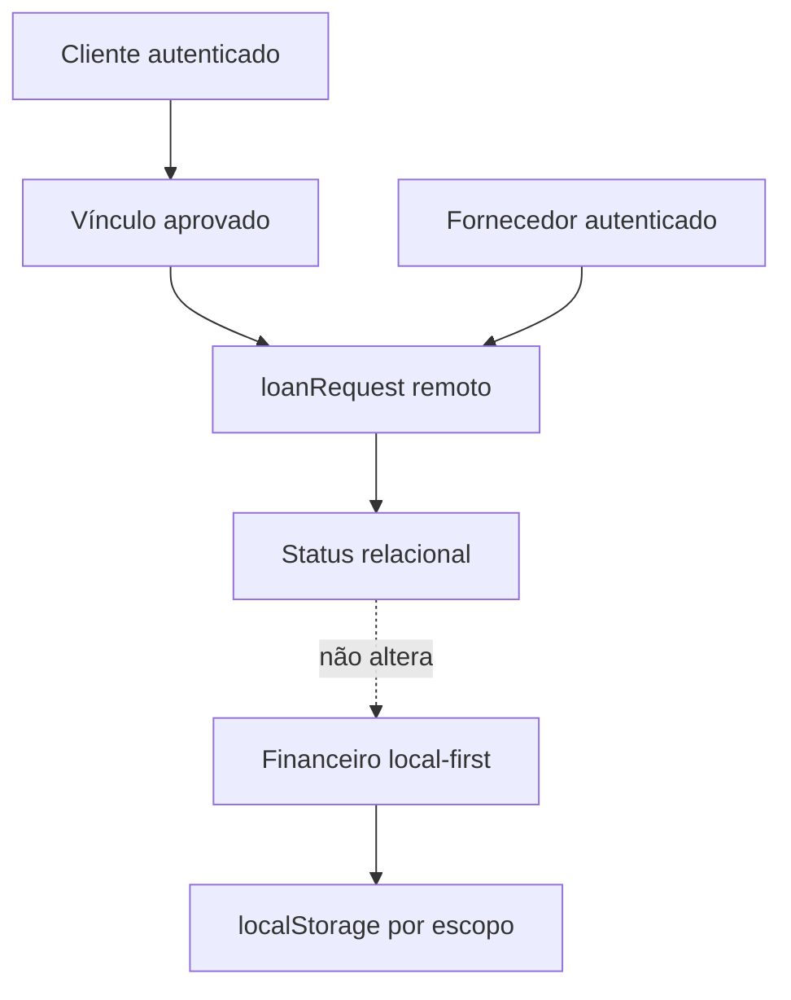

# Planejamento-Mestre LoanRequest Pré-Financeiro

**Tipo:** planejamento-mestre para implementação incremental (referência entre chats).

**Documentos relacionados:** [NEXT_PHASE_OFFICIAL.md](./NEXT_PHASE_OFFICIAL.md), [HANDOFF_MASTER.md](./HANDOFF_MASTER.md), [CHECKPOINT_CHECKLIST.md](./CHECKPOINT_CHECKLIST.md), [ADR_PAYMENT_LINK_CONTEXT.md](./ADR_PAYMENT_LINK_CONTEXT.md).

**Origem:** cópia estável do artefato de planejamento gerado no Cursor (plan `loanrequest_master_plan_087bd534`).

---

## Checklist de continuidade (subfases planejadas)

- [x] Fechar recorte funcional v1 de `loanRequest`: status, duplicidade, limites, contraproposta e leitura. → `docs/LOANREQUEST_V1_CONTRATO_FUNCIONAL_SUBFASE1.md`
- [x] Desenhar modelo remoto, rules e índices de `loanRequests` antes de UI. → `docs/FIRESTORE_LOANREQUESTS.md`, `firestore.rules`, `firestore.indexes.json`, `src/firebase/loanRequests.js`
- [ ] Promover a matriz QA inicial para checklist executável específico da fase.
- [ ] Planejar/implementar UI mínima do cliente para criar e acompanhar pedidos em subfase futura.
- [ ] Planejar/implementar UI mínima do fornecedor para listar e responder pedidos em subfase futura.

---

## 1. Entendimento do estado atual

### Confirmar o que está consolidado

- O AGEmp / Finanças Pro é hoje um app web/PWA com **núcleo financeiro local-first**.
- Dados financeiros continuam locais em `localStorage`, separados por escopo **`anonymous`** e **`account:{uid}`**.
- Firebase já existe e está ativo para **Auth**, perfil remoto em `users/{uid}`, `accountRoles` com fallback para `role` legado e vínculos remotos fornecedor/cliente em `links`.
- O código real confirma essa base em [`src/auth/AuthContext.jsx`](../src/auth/AuthContext.jsx), [`src/firebase/users.js`](../src/firebase/users.js), [`src/firebase/roles.js`](../src/firebase/roles.js), [`src/firebase/links.js`](../src/firebase/links.js) e [`firestore.rules`](../firestore.rules).
- A camada remota atual é relacional/identidade; ela **não** é fonte financeira.
- `client.linkContext` existe como metadado local opcional.
- `loan.linkContext` existe como snapshot local opcional do contrato.
- Pagamento **não** persiste `payment.linkContext`; a exibição em pagamentos é derivada de `loan.linkContext` conforme [ADR_PAYMENT_LINK_CONTEXT.md](./ADR_PAYMENT_LINK_CONTEXT.md).
- `calculations.js` segue como motor financeiro crítico e fora de mudança nesta linha.
- A trilha local-first de `linkContext` no fluxo do cliente foi formalmente encerrada.
- A próxima fase oficial documentada é a ponte controlada fornecedor/cliente, pré-financeira, sem sync financeiro remoto, conforme [NEXT_PHASE_OFFICIAL.md](./NEXT_PHASE_OFFICIAL.md).

### Confirmar o que já foi validado

- O gate manual geral registrou OK integral dos cenários 1.1 a 9.1 em [QA_MATRIX_GENERAL.md](./QA_MATRIX_GENERAL.md), sem NOK crítico.
- O ciclo local-first atual pode ser tratado como praticamente encerrado segundo F2/F5 da matriz geral.
- A matriz específica [QA_MATRIX_LINK_OPERATIONAL_VIEW.md](./QA_MATRIX_LINK_OPERATIONAL_VIEW.md) permanece como checklist regressivo para a linha de vínculo local.
- A base de identidade/vínculos remotos já possui regras Firestore e funções utilitárias com transições de vínculo conservadoras.

### Confirmar o que continua fora do escopo

- Sync remoto de clientes, contratos, pagamentos, caixa, dashboard ou backups.
- Coleções Firestore autoritativas para o domínio financeiro local.
- `payment.linkContext` persistido.
- Mudança em `calculations.js`.
- Conversão automática de solicitação aprovada em contrato.
- Vínculo remoto como permissão financeira local.
- Notificações FCM, Cloud Functions, dashboard financeiro remoto e automações financeiras.
- Redesign amplo ou nova arquitetura de navegação por inércia.

## 2. Definição do bloco oficial

### Nome claro da fase

**Fase LoanRequest v1 — Ponte Pré-Financeira Fornecedor/Cliente**

### Objetivo central

Criar a primeira camada executável de solicitações remotas de empréstimo (`loanRequest`) entre cliente e fornecedor vinculados, tratando o pedido como **intenção relacional pré-financeira**, sem tocar no domínio financeiro local.

### Problema que resolve

O projeto já tem conta, papéis e vínculos remotos, mas ainda não tem um fluxo de produto para o cliente expressar uma intenção de empréstimo ao fornecedor dentro da plataforma. Essa lacuna impede avançar a visão fornecedor/cliente sem arriscar acoplamento prematuro com contratos, pagamentos, caixa e cálculos locais.

### Por que essa é a próxima fase mais coerente

- Usa a camada Firebase que já existe, sem reabrir o ciclo local-first encerrado.
- Entrega valor real para a visão multiusuário sem transformar o Firebase em fonte financeira.
- Cria uma ponte governada entre vínculo remoto e intenção de negócio.
- Preserva todos os guardrails congelados: sem sync financeiro, sem `payment.linkContext`, sem `calculations.js`, sem contrato automático.

## 3. Saída do PM/PO

### Objetivo do produto/bloco

Permitir que clientes autenticados e vinculados enviem solicitações remotas de empréstimo para fornecedores, e que fornecedores acompanhem e respondam essas solicitações, sempre como fluxo relacional pré-financeiro.

### Problema que resolve

Hoje o vínculo remoto identifica uma relação fornecedor/cliente, mas não há ação de produto que use essa relação para iniciar uma conversa estruturada de pedido. O `loanRequest` resolve isso sem confundir solicitação com contrato financeiro.

### Público-alvo

- Cliente autenticado com papel efetivo `client` e vínculo aprovado com um fornecedor.
- Fornecedor autenticado com papel efetivo `supplier` que recebe e avalia pedidos.
- Usuário sem conta permanece atendido pelo app local, mas não participa de solicitações remotas.

### Proposta de valor

Validar a ponte fornecedor/cliente com baixo risco: cliente consegue pedir, fornecedor consegue responder, e o app preserva o financeiro local-first intacto.

### MVP

O MVP recomendado inclui:

- Cliente vê fornecedores com vínculo aprovado.
- Cliente cria solicitação com valor solicitado e observação opcional.
- Solicitação é salva remotamente como `loanRequest` com status inicial `pending`.
- Cliente acompanha lista e detalhe/status das próprias solicitações.
- Fornecedor vê solicitações recebidas.
- Fornecedor pode aprovar, recusar ou marcar em análise.
- Contraproposta pode entrar no MVP apenas se for validada como essencial; caso contrário fica na subfase seguinte.
- Aprovação não cria contrato automaticamente.
- Nenhum dado financeiro local é criado ou alterado por causa do pedido.

### Fora do escopo

- Sync financeiro remoto.
- Conversão pedido aprovado para contrato.
- Escrita em clientes, contratos, pagamentos, caixa, dashboard ou backups.
- `payment.linkContext`.
- Mudanças em `calculations.js`.
- Notificações push.
- Cloud Functions.
- Dashboard remoto de pedidos ou indicadores financeiros por vínculo.
- Reestruturação grande da navegação.

### Critérios de aceite de alto nível

- Usuário sem conta continua operando o financeiro local.
- Cliente sem vínculo aprovado não consegue criar pedido, mas recebe orientação clara.
- Cliente com vínculo aprovado cria uma solicitação remota sem alterar dados locais financeiros.
- Fornecedor participante consegue listar e responder pedidos recebidos.
- Cliente vê a resposta/status atualizado.
- UI deixa claro que solicitação é pedido na plataforma, não contrato nem financeiro em nuvem.
- Backup/exportação local não inclui `loanRequest` como domínio financeiro.
- Pagamentos continuam sem `payment.linkContext`.
- Dashboard, caixa e cálculos não mudam após criar/responder solicitação.

### Prioridades recomendadas

1. Fechar o recorte v1: criação/listagem/resposta simples, sem conversão.
2. Definir status e transições mínimas antes de código.
3. Desenhar rules de Firestore antes de UI.
4. Criar matriz QA específica executável para `loanRequest`.
5. Implementar em subfases pequenas com Composer 2 Fast.

## 4. Saída do Analyst

### Atores do sistema

- **Cliente autenticado**: cria, acompanha e eventualmente cancela solicitações.
- **Fornecedor autenticado**: lista, analisa e responde solicitações recebidas.
- **Usuário sem conta**: usa o financeiro local, sem acesso às solicitações remotas.
- **Firebase Auth/perfil/papéis**: identifica usuário e papel efetivo.
- **Vínculo remoto aprovado**: fornece contexto relacional para permitir a solicitação.
- **Domínio financeiro local**: permanece separado e não reage automaticamente ao pedido.

### Casos de uso

- Cliente cria solicitação para fornecedor vinculado.
- Cliente acompanha status da solicitação.
- Cliente cancela solicitação enquanto permitido.
- Fornecedor lista solicitações recebidas.
- Fornecedor marca solicitação como em análise.
- Fornecedor aprova solicitação.
- Fornecedor recusa solicitação.
- Fornecedor envia contraproposta, se o recorte incluir essa etapa.
- Usuário sem conta continua usando o app local.

### Fluxos principais

**Criação pelo cliente**

1. Cliente autenticado acessa a área de solicitações.
2. App lista vínculos aprovados em que o usuário é cliente.
3. Cliente escolhe fornecedor.
4. Cliente informa valor solicitado e nota opcional.
5. Sistema valida papel, vínculo, participantes e valor.
6. Sistema grava `loanRequest` remoto com status `pending`.
7. Cliente recebe confirmação e vê o pedido na lista.

**Resposta do fornecedor**

1. Fornecedor autenticado acessa solicitações recebidas.
2. App lista pedidos em que `supplierId` é o usuário atual.
3. Fornecedor abre pedido.
4. Fornecedor aprova, recusa, marca em análise ou contrapropõe conforme recorte da subfase.
5. Sistema valida transição e grava status remoto.
6. Cliente vê a mudança de status.

**Preservação local-first**

1. Criar ou responder `loanRequest` não chama fluxo de clientes/contratos/pagamentos locais.
2. Storage financeiro, backup, dashboard, caixa e cálculos permanecem intocados.
3. UX reforça que é solicitação na plataforma, não contrato.

### Fluxos alternativos

- Cliente sem fornecedores aprovados vê estado vazio com orientação para criar/aprovar vínculo.
- Fornecedor sem pedidos vê estado vazio simples.
- Usuário sem Firebase disponível vê solicitações indisponíveis, mas app local funcionando.
- Solicitação com valor inválido não salva.
- Solicitação cujo vínculo foi revogado não aceita novas ações, salvo regra futura de histórico.
- Status alterado por outra sessão antes da ação gera recarregamento/erro de concorrência.

### Regras de negócio

- `loanRequest` é intenção relacional pré-financeira.
- Criação exige autenticação e papel efetivo `client`.
- Resposta exige autenticação e papel efetivo `supplier`.
- A solicitação deve referenciar vínculo remoto aprovado por `linkId`.
- `supplierId` e `clientId` devem ser contas distintas.
- Pedido aprovado não cria contrato.
- Contraproposta, se existir, continua sendo status relacional.
- Vínculo remoto não autoriza nem bloqueia operações financeiras locais.
- Dados financeiros locais continuam por escopo `anonymous` e `account:{uid}`.
- Pagamento não ganha `payment.linkContext`.
- `calculations.js` não participa da fase.

### Status e transições

Status planejados para v1:

- `pending`: pedido criado e aguardando fornecedor.
- `under_review`: fornecedor marcou como em análise.
- `approved`: fornecedor aprovou a intenção.
- `rejected`: fornecedor recusou.
- `counteroffer`: fornecedor propôs outro valor, se incluído no recorte.
- `cancelled_by_client`: cliente cancelou antes de decisão final.

Status planejado, mas bloqueado nesta fase:

- `converted_to_contract`: só documental/futuro; não deve ser ativo na primeira fase executável.

Transições recomendadas:

- Cliente cria: novo pedido → `pending`.
- Cliente cancela: `pending` → `cancelled_by_client`.
- Cliente cancela durante análise: `under_review` → `cancelled_by_client`, se validado pelo produto.
- Fornecedor analisa: `pending` → `under_review`.
- Fornecedor aprova: `pending` ou `under_review` → `approved`.
- Fornecedor recusa: `pending` ou `under_review` → `rejected`.
- Fornecedor contrapropõe: `pending` ou `under_review` → `counteroffer`, se habilitado.
- Bloqueado: qualquer status → `converted_to_contract`.
- Bloqueado: finais `approved`, `rejected`, `cancelled_by_client` voltarem para estados abertos sem regra futura.

### Validações

- Usuário autenticado para qualquer operação remota.
- Papel efetivo compatível com ação.
- `accountRoles` como fonte principal, `role` legado como fallback.
- Vínculo aprovado compatível com `supplierId`, `clientId` e `linkId`.
- Valor solicitado positivo e numérico.
- Valores de aprovação/contraproposta positivos quando existirem.
- Notas com limite de tamanho a definir antes de implementação.
- Status conhecido e transição permitida.
- Timestamps coerentes: `createdAt`, `updatedAt`, `respondedAt`, `cancelledAt` quando aplicável.
- Nenhum efeito colateral em storage financeiro local.

### Cenários de erro

- Sem login: solicitações exigem conta; financeiro local segue disponível.
- Sem papel cliente: criação bloqueada.
- Sem papel fornecedor: resposta bloqueada.
- Sem vínculo aprovado: criação bloqueada.
- Vínculo revogado: novas ações bloqueadas conforme regra de histórico.
- Valor inválido: erro de formulário.
- Transição inválida: ação indisponível.
- Falha Firebase/rede: erro claro, sem afetar dados locais.
- Solicitação inexistente ou sem acesso: erro seguro sem vazar dados.
- Tentativa de converter em contrato: bloqueada nesta fase.

### Dependências

- Firebase Auth já existente.
- Perfil remoto `users/{uid}`.
- `accountRoles` e fallback `role`.
- Vínculos remotos aprovados em `links`.
- Firestore rules específicas para `loanRequests`.
- UI de Conta/Configurações existente como superfície inicial provável.

### Premissas e pontos que exigem confirmação

- Confirmado: `loanRequest` é pré-financeiro.
- Confirmado: aprovação não cria contrato.
- Confirmado: sem sync financeiro e sem `payment.linkContext`.
- A confirmar: se contraproposta entra no MVP ou na subfase seguinte.
- A confirmar: se cliente pode cancelar durante `under_review`.
- A confirmar: limite mínimo/máximo de valor e tamanho das notas.
- A confirmar: regra de duplicidade, por exemplo uma solicitação ativa por `linkId` ou múltiplas solicitações históricas.
- A confirmar: se leitura simples (`readByClientAt`, `readBySupplierAt`) entra na v1.

## 5. Saída do Architect

### Visão geral da arquitetura da fase

A fase adiciona uma coleção remota separada para `loanRequests`, apoiada por Auth, perfis, papéis e vínculos já existentes. Essa coleção representa apenas intenção relacional. Ela não aponta para cliente local, contrato local, pagamento local, caixa, dashboard ou backup como fonte financeira.

Fluxo conceitual:

### Componentes/superfícies envolvidos

- [`src/auth/AuthContext.jsx`](../src/auth/AuthContext.jsx): sessão e disponibilidade de conta.
- [`src/firebase/users.js`](../src/firebase/users.js): perfil remoto.
- [`src/firebase/roles.js`](../src/firebase/roles.js): papéis efetivos.
- [`src/firebase/links.js`](../src/firebase/links.js): vínculo aprovado como pré-condição relacional.
- [`firestore.rules`](../firestore.rules): regras remotas para nova coleção.
- Superfície provável de UI: área de Conta/Configurações, evitando nova navegação principal pesada na primeira fase.
- Componentes futuros pequenos: lista de solicitações, formulário de criação e painel de resposta.

### Responsabilidades por componente

- **Nova camada Firebase `loanRequests`**: CRUD controlado da intenção de pedido e transições de status.
- **Links**: confirmar vínculo aprovado e participantes.
- **Roles**: validar papel efetivo do ator.
- **UI Conta/Solicitações**: expor criação/listagem/resposta com linguagem pré-financeira.
- **Storage financeiro local**: nenhuma responsabilidade nova.
- **Calculations**: nenhuma responsabilidade nova.
- **Backups/import/export**: nenhuma responsabilidade nova.

### Modelagem inicial de `loanRequest`

Campos recomendados:

- `supplierId`: UID do fornecedor.
- `clientId`: UID do cliente.
- `linkId`: ID do vínculo aprovado.
- `requestedAmount`: valor solicitado.
- `clientNote`: observação opcional do cliente.
- `status`: status relacional.
- `approvedAmount`: valor aprovado, quando aplicável.
- `counterofferAmount`: valor de contraproposta, quando aplicável.
- `supplierNote`: observação opcional do fornecedor.
- `createdAt`: timestamp de criação.
- `updatedAt`: timestamp da última alteração.
- `respondedAt`: timestamp de resposta/contraproposta, quando aplicável.
- `cancelledAt`: timestamp de cancelamento, quando aplicável.
- `readByClientAt` e `readBySupplierAt`: planejados; só implementar se a subfase incluir leitura simples.

Recomendação de coleção:

- `loanRequests/{loanRequestId}` como coleção top-level.
- Evitar embutir pedidos em `links/{linkId}` para não misturar ciclo de vida de vínculo com ciclo de vida de pedido.

### Integrações afetadas

- Firestore rules precisarão incluir `loanRequests`.
- Índices Firestore podem ser necessários para consultas por `clientId`, `supplierId`, `status` e ordenação por data.
- UI de Conta terá novo bloco/superfície.
- Testes futuros devem cobrir utilitários de modelo/transição e regras de autorização.

### Riscos técnicos

- Rules permissivas demais expondo solicitações de terceiros.
- Consultas que exigem índices não planejados.
- Modelagem de status grande demais para a primeira entrega.
- Acoplamento indevido entre pedido aprovado e contrato local.
- UI sugerir nuvem financeira.
- Duplicidade de pedidos ativos sem regra.
- `loanRequest` entrar acidentalmente em backup local.

### Trade-offs

- Coleção top-level `loanRequests` é mais clara e escalável que subcoleção em `links`.
- Começar em Conta evita nova aba principal e reduz impacto na navegação.
- Incluir resposta do fornecedor no MVP dá fluxo completo, mas exige mais rules e QA.
- Deixar contraproposta para subfase seguinte reduz risco e acelera primeira entrega.
- Não usar Cloud Functions mantém simplicidade, mas exige rules bem desenhadas.

### Plano incremental por etapas

1. Fechar decisões pendentes de recorte.
2. Especificar modelo e transições finais da v1.
3. Desenhar Firestore rules e índices.
4. Criar matriz QA executável de `loanRequest`.
5. Implementar camada Firebase isolada.
6. Implementar UI mínima de cliente.
7. Implementar UI mínima de fornecedor.
8. Rodar regressão financeira/local-first.
9. Promover LKG da fase quando a matriz fechar.

### Decisões técnicas que exigem validação

- Contraproposta entra na v1 ou v1.1?
- `under_review` entra na primeira entrega ou é só resposta direta?
- Uma solicitação ativa por vínculo ou múltiplas simultâneas?
- Como ordenar/listar histórico: recentes primeiro, por status, ou agrupamento simples?
- Leitura simples entra agora ou depois?
- UI fica em Conta ou vira aba dedicada no futuro?
- Quais limites exatos de valor e texto?

## 6. UX mínima planejada

### Onde essa funcionalidade deve morar no app

Recomendação para a primeira fase: **dentro da área de Conta/Configurações**, como bloco ou superfície “Solicitações”.

Motivos:

- A funcionalidade pertence à camada remota de relacionamento.
- Evita competir com Dashboard/Clientes, que são superfícies do financeiro local.
- Reduz risco de o usuário interpretar pedidos como contratos ou extrato financeiro.
- Mantém o app mobile-first e simples.

Uma aba principal dedicada só deve ser considerada depois, se houver volume real de uso.

### Linguagem que não sugira financeiro na nuvem

Usar termos como:

- “Solicitação de empréstimo”
- “Pedido enviado ao fornecedor”
- “Intenção de pedido”
- “Aprovação do pedido não cria contrato automaticamente”
- “Seu financeiro local continua separado”

Evitar termos como:

- “Contrato aprovado”
- “Empréstimo criado”
- “Sincronizado na nuvem”
- “Dashboard do fornecedor”
- “Financeiro compartilhado”
- “Pagamento vinculado ao pedido”

### Estados visuais mínimos

- `pending`: âmbar/atenção suave, “Pendente”.
- `under_review`: azul/informação, “Em análise”.
- `approved`: verde/sucesso, “Aprovado”.
- `rejected`: vermelho/erro, “Recusado”.
- `counteroffer`: laranja/atenção, “Contraproposta”.
- `cancelled_by_client`: neutro, “Cancelado pelo cliente”.

A cor não deve ser o único indicador; sempre usar texto.

### Princípios mobile-first

- Formulário curto: fornecedor, valor, observação opcional, botão principal.
- Lista em cards simples, não tabela densa.
- Valor e status com leitura imediata.
- Uma ação principal por card quando possível.
- Estados vazios e erros curtos, humanos e claros.
- Sem excesso de badges ou metadados perto de valores.

### O que deve ficar fora da UI nesta fase

- Qualquer botão “Criar contrato” a partir da solicitação.
- Qualquer promessa de sincronização financeira.
- Totais, saldo, caixa ou dashboard derivados de pedidos.
- Histórico financeiro do cliente visível ao fornecedor.
- Pagamentos ou contratos locais da outra parte.
- Notificações push.
- Filtros avançados ou relatórios.

## 7. Matriz QA inicial refinada

### Guardrails globais

- QA-G1: Criar/responder/cancelar `loanRequest` não escreve clientes financeiros no Firestore.
- QA-G2: Criar/responder/cancelar `loanRequest` não escreve contratos financeiros no Firestore.
- QA-G3: Criar/responder/cancelar `loanRequest` não escreve pagamentos financeiros no Firestore.
- QA-G4: Criar/responder/cancelar `loanRequest` não altera caixa/dashboard/cálculos.
- QA-G5: `payment.linkContext` permanece inexistente.
- QA-G6: `calculations.js` permanece intocado.
- QA-G7: Usuário sem conta continua usando o financeiro local.
- QA-G8: Backup/exportação local não inclui `loanRequest` como domínio financeiro local.

### Conta, papéis e vínculo

- QA-R1: Cliente com papel efetivo `client` e vínculo aprovado consegue acessar criação.
- QA-R2: Cliente sem vínculo aprovado vê estado vazio/orientação.
- QA-R3: Conta sem papel cliente não cria solicitação.
- QA-R4: Fornecedor com papel efetivo `supplier` lista pedidos recebidos.
- QA-R5: Conta sem papel fornecedor não responde pedidos.
- QA-R6: `accountRoles` válido prevalece; `role` legado funciona como fallback quando aplicável.
- QA-R7: Usuário só lê pedidos em que é `clientId` ou `supplierId`.

### Criação de solicitação

- QA-C1: Cliente cria pedido com valor válido e nota vazia.
- QA-C2: Cliente cria pedido com valor válido e nota preenchida.
- QA-C3: Valor vazio, zero, negativo ou inválido bloqueia salvamento.
- QA-C4: Pedido criado nasce como `pending`.
- QA-C5: Pedido referencia `supplierId`, `clientId` e `linkId` coerentes com vínculo aprovado.
- QA-C6: Criação não altera lista de clientes locais, contratos, pagamentos, caixa ou dashboard.

### Listagem e acompanhamento

- QA-L1: Cliente vê seus pedidos enviados.
- QA-L2: Fornecedor vê pedidos recebidos.
- QA-L3: Usuário não participante não vê pedido.
- QA-L4: Lista vazia tem mensagem clara.
- QA-L5: Falha Firebase mostra erro e mantém financeiro local disponível.
- QA-L6: Reload mantém lista remota coerente quando Firebase disponível.

### Resposta e transições

- QA-S1: Fornecedor altera `pending` para `under_review`, se status existir na v1.
- QA-S2: Fornecedor aprova pedido permitido.
- QA-S3: Fornecedor recusa pedido permitido.
- QA-S4: Fornecedor envia contraproposta, se habilitado.
- QA-S5: Cliente cancela `pending`.
- QA-S6: Cliente cancela `under_review` somente se regra aprovada.
- QA-S7: Transição inválida é bloqueada.
- QA-S8: Status final não volta para aberto.
- QA-S9: `converted_to_contract` não aparece como ação ativa.

### UX e microcopy

- QA-U1: Textos não sugerem financeiro na nuvem.
- QA-U2: Solicitação aprovada deixa claro que não criou contrato.
- QA-U3: Mobile mostra cards legíveis e ações claras.
- QA-U4: Cores de status têm texto junto.
- QA-U5: A área não compete visualmente com valores financeiros locais.

### Regressão local-first

- QA-F1: Dashboard permanece igual após ações de pedido.
- QA-F2: Clientes locais permanecem iguais após ações de pedido.
- QA-F3: Contratos locais permanecem iguais após ações de pedido.
- QA-F4: Pagamentos locais permanecem sem `payment.linkContext`.
- QA-F5: Caixa permanece igual após ações de pedido.
- QA-F6: Export/import local segue funcionando.
- QA-F7: Auto-backup não incorpora pedidos remotos como financeiro local.

## 8. Subfases futuras prontas para Composer 2 Fast

### Subfase 1 — Fechamento de Recorte e Contrato Funcional

**Objetivo:** transformar este planejamento em especificação curta de implementação v1.

**O que entra:** status finais da v1, regra de duplicidade, limites de valor/nota, decisão sobre `under_review`, contraproposta e leitura.

**O que não entra:** código, UI, rules e testes.

**Critérios de pronto:** decisões pendentes marcadas como aceitas ou adiadas; escopo v1 fechado em um checklist curto.

**Riscos:** tentar incluir contraproposta, leitura e histórico avançado cedo demais.

**Dependências:** este planejamento aprovado.

**Ordem recomendada:** primeira subfase.

### Subfase 2 — Modelo Remoto e Firestore Rules

**Objetivo:** desenhar e implementar de forma isolada a coleção `loanRequests` e suas regras.

**O que entra:** constantes/status, helpers de validação, rules para create/read/update, índices necessários e testes de regras/utilitários se disponíveis.

**O que não entra:** UI completa, contrato automático, cálculos, storage local financeiro.

**Critérios de pronto:** cliente só cria para vínculo aprovado; fornecedor só responde pedidos próprios; participante só lê o que participa; transições inválidas bloqueadas.

**Riscos:** rules permissivas, queries sem índice, validação de vínculo insuficiente.

**Dependências:** Subfase 1 e camada existente de links/roles.

**Ordem recomendada:** segunda.

### Subfase 3 — UI Cliente: Criar e Acompanhar Pedido

**Objetivo:** permitir ao cliente criar e acompanhar solicitações.

**O que entra:** bloco em Conta/Solicitações, lista de fornecedores aprovados, formulário valor/nota, lista de pedidos enviados, cancelamento permitido.

**O que não entra:** resposta do fornecedor se ainda não feita; conversão em contrato; dados financeiros locais da outra parte.

**Critérios de pronto:** cliente cria pedido válido; vê status; cancela quando permitido; estados vazio/erro/loading cobertos; microcopy local-first preservada.

**Riscos:** UI sugerir contrato ou sync; formulário ficar pesado no mobile.

**Dependências:** Subfase 2.

**Ordem recomendada:** terceira.

### Subfase 4 — UI Fornecedor: Fila e Resposta Simples

**Objetivo:** permitir ao fornecedor listar e responder pedidos recebidos.

**O que entra:** lista recebida, detalhe simples, aprovar/recusar, `under_review` se aprovado no recorte, nota do fornecedor se definida.

**O que não entra:** contraproposta se adiada; contrato automático; dashboard financeiro.

**Critérios de pronto:** fornecedor participante responde; cliente vê status atualizado; transições inválidas bloqueadas; financeiro local intocado.

**Riscos:** confundir aprovação com contrato; excesso de ações por card.

**Dependências:** Subfases 2 e 3.

**Ordem recomendada:** quarta.

### Subfase 5 — Contraproposta v1.1

**Objetivo:** permitir contraproposta sem abrir conversão financeira.

**O que entra:** `counteroffer`, `counterofferAmount`, `supplierNote`, exibição para cliente e decisão básica sobre encerrar ou manter pedido.

**O que não entra:** aceite que cria contrato; negociação multi-rodadas complexa; notificações.

**Critérios de pronto:** fornecedor contrapropõe; cliente visualiza claramente; status não cria efeito financeiro.

**Riscos:** virar fluxo de negociação complexo; exigir histórico de mensagens.

**Dependências:** Subfases 1 a 4, se contraproposta não entrar no MVP.

**Ordem recomendada:** quinta, salvo decisão de produto de incluir no MVP.

### Subfase 6 — Leitura Simples e Polimento de Lista

**Objetivo:** melhorar acompanhamento sem FCM.

**O que entra:** `readByClientAt`, `readBySupplierAt` se decidido, indicador discreto de novo/atualizado, filtros simples por status.

**O que não entra:** push notification, Cloud Functions, analytics pesado.

**Critérios de pronto:** leitura funciona sem ruído, não afeta financeiro local, UI continua simples.

**Riscos:** adicionar complexidade visual e estado demais.

**Dependências:** Subfases 3 e 4.

**Ordem recomendada:** depois do fluxo base validado.

### Subfase 7 — QA Formal e LKG da Fase

**Objetivo:** fechar a fase com regressão executável e tag estável.

**O que entra:** matriz QA específica executada, regressão local-first, validação de rules, testes automatizados pertinentes, atualização de handoff/checkpoint.

**O que não entra:** novas features.

**Critérios de pronto:** sem NOK crítico; guardrails G1–G8 OK; LKG promovido.

**Riscos:** fechar LKG sem validar app sem conta, storage local e ausência de efeito financeiro.

**Dependências:** implementação das subfases escolhidas.

**Ordem recomendada:** ao final de cada pacote funcional relevante ou no fechamento do bloco v1.

### Subfase 8 — Planejamento Futuro de Conversão Manual

**Objetivo:** decidir, em fase própria, se pedido aprovado poderá virar contrato local manualmente.

**O que entra:** ADR futura, riscos de migração, UX de conversão manual, relação com cliente local e contrato local.

**O que não entra:** implementação automática, sync financeiro remoto, alteração em `calculations.js` sem decisão.

**Critérios de pronto:** decisão explícita, ADR e QA antes de qualquer código.

**Riscos:** abrir sync financeiro por acidente.

**Dependências:** LoanRequest v1 validado e demanda real do produto.

**Ordem recomendada:** somente após v1 estabilizada.

## 9. Recomendação final

Este planejamento está maduro o suficiente para reduzir microplanejamentos futuros no curto prazo, desde que a próxima conversa de implementação comece pela **Subfase 1 — Fechamento de Recorte e Contrato Funcional** e não tente implementar UI, rules e fluxo completo ao mesmo tempo.

A primeira subfase de implementação com Composer 2 Fast deve ser:

**Subfase 1 — Fechamento de Recorte e Contrato Funcional**

Saída esperada dessa primeira subfase:

- decidir se MVP inclui contraproposta ou deixa para v1.1;
- decidir se `under_review` entra já;
- definir regra de duplicidade;
- definir limites de valor e nota;
- congelar transições v1;
- transformar a matriz QA acima em checklist curto de aceite para o primeiro PR.

Depois dela, a implementação deve seguir pela camada remota/rules antes da UI. Isso evita que a experiência visual empurre decisões técnicas frágeis e preserva a fronteira central do projeto: solicitação remota é relacionamento pré-financeiro, não domínio financeiro sincronizado.
